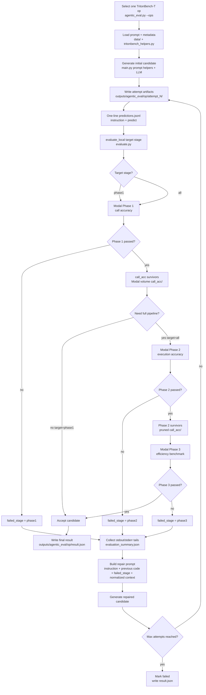

# Deepbork Agentic Flow



## Stage Mapping

```text
agentic_eval.py --target-stage phase1
  -> evaluate.py evaluate_local phase1
  -> Modal Phase 1

agentic_eval.py --target-stage all
  -> evaluate.py evaluate_local all
  -> Modal Phase 1 -> Phase 2 -> Phase 3
```

Every repaired candidate restarts evaluation from Phase 1. A repair motivated
by Phase 3 can still break imports, Triton compilation, wrapper semantics, or
Phase 2 correctness, so previous phase results are not reused after code
changes.

## Artifact Locations

```text
Local attempt artifacts:
outputs/agentic_eval/<op>/attempt_N/
  predictions.jsonl
  predict.py
  evaluation_summary.json
  repair_prompt.json

Local final result:
outputs/agentic_eval/<op>/result.json

Modal attempt artifacts:
results/eval/agentic/<op>/attempt_N/
  call_acc/
  perf_results/
  logs/
```
